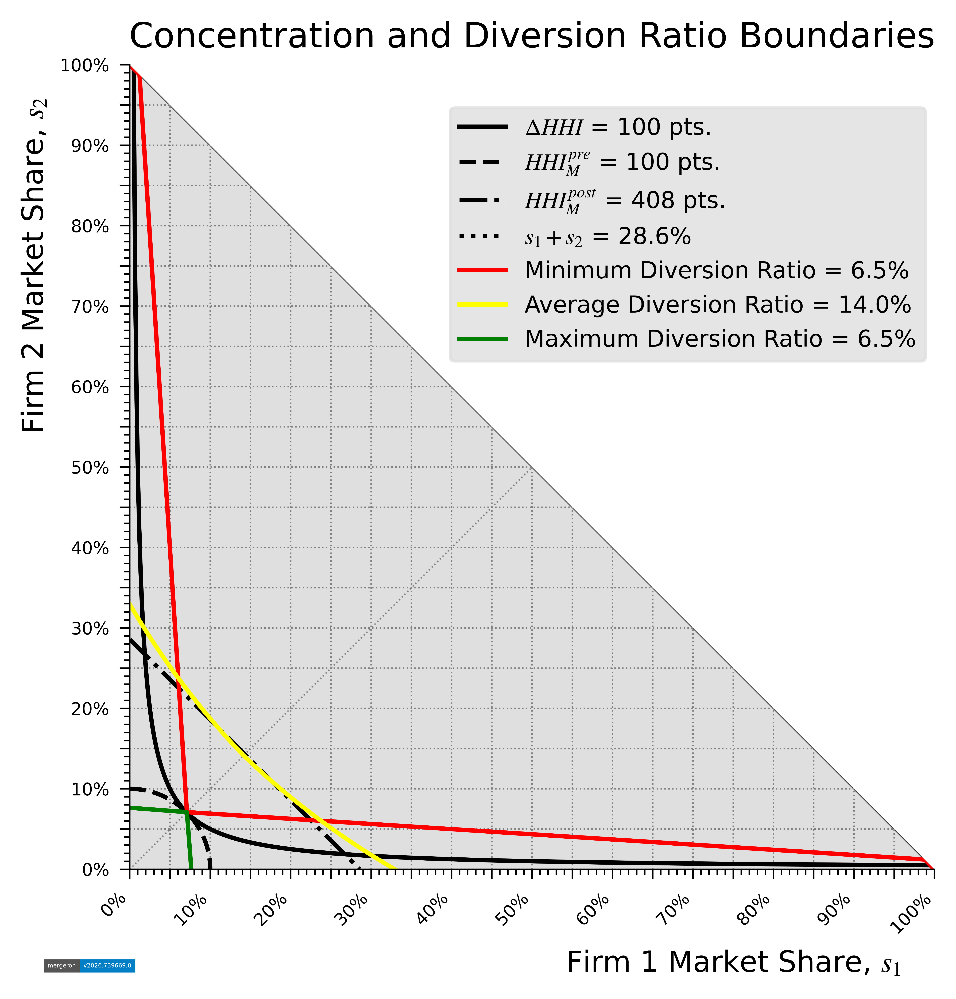

mergeron: Python for analyzing merger enforcement policy
========================================================

.. cspell:enableCompoundWords
.. cspell: ignoreRegExp /^\\.\\. image:: .*^ +:target:/gim

.. |br| raw:: html

    

.. image:: https://img.shields.io/pypi/v/mergeron
    :alt: PyPI - Package Version
    :target: https://pypi.python.org/pypi/mergeron/

.. image:: https://img.shields.io/pypi/pyversions/mergeron
    :alt: PyPI - Python Version
    :target: https://pypi.python.org/pypi/mergeron/

.. image:: https://img.shields.io/pypi/status/mergeron
    :alt: PyPI - Package status
    :target: https://pypi.python.org/pypi/mergeron/

.. image:: https://github.com/capeconomics/mergeron/actions/workflows/documentation.yml/badge.svg
   :alt: Documentation
   :target: https://github.com/capeconomics/mergeron/actions/workflows/documentation.yml

.. image:: https://github.com/capeconomics/mergeron/actions/workflows/packaging.yml/badge.svg
    :alt: CI
    :target: https://github.com/capeconomics/mergeron/actions/workflows/packaging.yml

|br|

.. image:: https://img.shields.io/endpoint?url=https://raw.githubusercontent.com/astral-sh/uv/main/assets/badge/v0.json
   :alt: Package manager: uv
   :target: https://github.com/astral-sh/uv

.. image:: https://www.mypy-lang.org/static/mypy_badge.svg
    :alt: Type checker: mypy
    :target: https://mypy-lang.org/

.. image:: https://img.shields.io/endpoint?url=https://raw.githubusercontent.com/astral-sh/ruff/main/assets/badge/v2.json
    :alt: Formatter: ruff
    :target: https://github.com/astral-sh/ruff

.. image:: https://img.shields.io/badge/License-BSD_3--Clause-blue.svg
   :alt: License: BSD-3-Clause
   :target: https://opensource.org/licenses/BSD-3-Clause

*Visualize* the sets of mergers falling within specified concentration and diversion-ratio thresholds.  *Analyze* merger investigations data published by the U.S. Federal Trade Commission in various reports on extended merger investigations (Second Requests) during 1996 to 2011.
*Generate* data under specified distributions of firm counts, market shares, price-cost margins, and prices, optionally imposing equilibrium conditions for Bertrand oligopoly with MNL demand and restrictions implied by statutory filing thresholds. *Compute* intrinsic enforcement rates or intrinsic clearance rates using generated data, with bounds for:
concentration;
diversion ratio;
gross upward pricing pressure (GUPPI);
critical marginal cost reduction (CMCR); and
illustrative price rise (IPR).

Installation
--------------
To install mergeron, execute the following shell command:

.. code:: sh

    python -m pip install mergeron

Usage
--------------

Visualizing Guidelines boundaries
~~~~~~~~~~~~~~~~~~~~~~~~~~~~~~~~~

The following is an example of plotting concentration and diversion ratio boundaries at specified thresholds.

.. code-block:: python3

    from mergeron import UPPAggregator
    from mergeron.core import guidelines_boundaries as gb

    _h_bar = 0.01
    _combined_share = 2 * round(1/7, 2)  # 7-to-6 merger from symmetry
    _recapture_rate = 0.85  # also the default
    (
        concentration_delta_boundary,
        concentration_premerger_boundary,
        concentration_postmerger_boundary,
        combined_share_boundary,
    ) = (
        gb.ConcentrationBoundary(_h, _f)
        for _h, _f in (
            (_h_bar, "ΔHHI"),
            (_h_bar, "HHI contribution, pre-merger"),
            (_combined_share**2, "HHI contribution, post-merger"),
            (_combined_share, "Combined share"),
        )
    )

    (
        diversion_boundary_a,
        diversion_boundary_i,
        diversion_boundary_x,
    ) = (
        gb.DiversionBoundary(_g, _recapture_rate, aggregator=_a)
        for _g, _a in (
        (round(_combined_share / 2, 2), UPPAggregator.AVG),
        (gb.guppi_from_delta(_h_bar, m_star=1.0, r_bar=_recapture_rate), UPPAggregator.MIN),  # default m_star, r_bar
        (gb.guppi_from_delta(_h_bar), UPPAggregator.MAX),
        )
    )

Boundary plots are created with Matplotlib and the provided function, :func:`guidelines_boundary_functions()`,
and written to PDF with backend="pgf" as the default (Matplotlib) backend.
In Jupyter or Marimo notebooks, use backend="inline" for inline rendering, as below.

.. code-block:: python3

    from matplotlib import pyplot as plt
    from mergeron.core import guidelines_boundary_functions as gbf

    fig, _ = gbf.boundary_plot(plt, backend="inline")
    ax = fig.gca()
    ax.set_facecolor("0.875")

    ax.set_title("Concentration and Diversion Ratio Boundaries")

    for _boundary, _linestyle, _label in (
        (concentration_delta_boundary, "-", f"$ΔHHI$ = {_h_bar * 1e4:.0f} pts."),
        (concentration_premerger_boundary, "--", f"$HHI_M^{{pre}}$ = {_h_bar * 1e4:.0f} pts."),
        (concentration_postmerger_boundary, "-.", f"$HHI_M^{{post}}$ = {2 * (1/7)**2 * 1e4:.0f} pts."),
        (combined_share_boundary, ":", f"$s_1 + s_2$ = {2 * 1/7:.1%}")
    ):
        ax.plot(
            _boundary.coordinates[:, 0],
            _boundary.coordinates[:, 1],
            color="black",
            linestyle=_linestyle,
            label=_label,
        )

    for _boundary, _linecolor, _label in (
        (diversion_boundary_i, "red", f"Minimum Diversion Ratio = {gb.guppi_from_delta(_h_bar):.1%}"),
        (diversion_boundary_a, "yellow", f"Average Diversion Ratio = {gb.guppi_from_delta(2 * (1/7)**2):.1%}"),
        (diversion_boundary_x, "green", f"Maximum Diversion Ratio = {gb.guppi_from_delta(_h_bar):.1%}"),
    ):
        ax.plot(
            _boundary.coordinates[:, 0],
            _boundary.coordinates[:, 1],
            color=_linecolor,
            linestyle="-",
            label=_label,
        )

    _ = fig.legend(
        fontsize=8, facecolor="0.875", edgecolor="0.875", bbox_to_anchor=(0.90, 0.85)
    )

    plt.show()

Mathematically, the enforcement boundary based on postmerger HHI contribution is identical to that based on the combined share, as

.. math::

    \begin{align}
        \lbrace (s_1, s_2) \mid (s_1 + s_2)^2 &= (2 \overline{\symup{s}})^2 \rbrace
        \equiv \lbrace (s_1, s_2) \mid (s_1 + s_2) =  2 \overline{\symup{s}} \rbrace \\
        \text{with, }
            \overline{\symup{s}} &\triangleq \left\lceil{(\overline{\symup{H}} + 1 ) / \overline{\symup{H}}}\right\rceil^{-1}
    \end{align}

The above result is apparent from the boundary plot above, where the enforcement boundary based on postmerger HHI contribution is identical to that based on the combined share, for a combined share of 28.6% corresponding to the 7-to-6 merger from symmetry, *i.e.,* at the enforcement margin under the concentration standards in the 2023 Guidelines.

Moreover, the combined-share boundary closely approximates the average diversion ratio boundary, while the ΔHHI boundary and the pre-merger concentration boundary approximate the minimum and maximum diversion ratio boundaries, respectively.  (Each of the minimun and maximum diversion ratio boundaries is also the “dual” of the other around the axis of symmetry.)

Analyzing FTC Merger Investigations Data
~~~~~~~~~~~~~~~~~~~~~~~~~~~~~~~~~~~~~~~~~

Analyze observed enforcement rates reported in various tables presented in published FTC merger investigations data, and in the table aggregates constructed in this package. Note that, in the source data, odd-numbered tables report FTC investigations data organized by post-merger HHI and ΔHHI; and even-numbered tables report by firm-count.

.. code-block:: python3

    from mergeron.core import DELTA_HEADER_DICT
    from mergeron.core import ftc_merger_investigations_data as fid
    from mergeron.gen import enforcement_stats as es

    investigations_data = fid.construct_data(fid.INVDATA_ARCHIVE_PATH)
    invdata_table_1, invdata_table_2 = (
        investigations_data[_p]["ByHHIandDelta"]["Table 9.2"]
        for _p in ("1996-2003", "2004-2011")
    )

    counts_by_delta_1, counts_by_delta_2 = (
        es.enforcement_counts(_t.data_array, es.StatsGroup.DL)
        for _t in (invdata_table_1, invdata_table_2)
    )

Estimate enforcement rates from reported counts of investigated mergers and enforced mergers.

.. code-block:: python3

    observed_enforcement_rates = list(
        zip(
            (
                {_v: _k for _k, _v in DELTA_HEADER_DICT.items()}[i]
                for i in counts_by_delta_1[:, 0]
            ),
            (
                f"{_e[1] / _e[-1]:3.2%}" if _e[-1] else "---"
                for _e in counts_by_delta_1
            ),
            (
                f"{_t[1] / _t[-1]:3.2%}" if _t[-1] else "---"
                for _t in counts_by_delta_2
            ),
        )
    )

    observed_enforcement_rates.append([
        "Total",
        f"{counts_by_delta_1[:, 1].sum() / counts_by_delta_1[:, -1].sum():3.2%}",
        f"{counts_by_delta_2[:, 1].sum() / counts_by_delta_2[:, -1].sum():3.2%}",
    ])

.. code-block:: python3

    import tabulate

    print(
        "Enforcement Rates for Investigated Mergers",
        "U. S. Federal Trade Commission",
        "1996-2003 vs 2004-2011",
        f'Markets with Entry Barriers ("{invdata_table_1.additional_evidence}")',
        sep="\n",
    )
    print()
    print(
        tabulate.tabulate(
            observed_enforcement_rates,
            # tablefmt="simple",
            tablefmt="html", stralign=None, numalign=None,
            maxheadercolwidths=12,
            headers=("ΔHHI", "1996-2003", "2004-2011"),
        )
    )

.. raw:: html
    :file: _static/table_ocr_ftcinvdata_entrybarriers.html

.. admonition:: Note

    Tables shown here are produced by calling, `tabulate.tabulate()` with `tablefmt="html"`, adding a style sheet, and tagging the printed headings as a `caption`.

Generating synthetic market data and computing intrinsic enforcement rates
~~~~~~~~~~~~~~~~~~~~~~~~~~~~~~~~~~~~~~~~~~~~~~~~~~~~~~~~~~~~~~~~~~~~~~~~~~~~~~~~~~

Intrinsic clearance rates are deterministic and computed to a high degree of precision by numerical integration with a sufficiently large number of draws. In the source data, only a small proportion of the total falls in certain ranges. Accordingly, 100 million draws provide precision to approximately three (3) decimal places including on ranges within which a small proportion of the sample falls (subject to theoretical numerical precision and the
numerical accuracy of modern computers). CPU and wall clock times are reported below for selected examples of enforcement rates.

Table 10.2 reports counts of investigated, "enforced", and "closed" mergers in markets with barriers to entry categorized by pre-merger firm count, as reported in FTC merger investigations data for 1996-2003. Simulated markets in the examples below are initially drawn such that the relative frequency of draws (simulated markets) by pr-merger firm count matches the relative frequency of markets in Table 10.2 of the report covering FTC merger investigations during 1996-2003 (dropping the "11+" category).

A HSR filing is assumed if the smaller firm is no smaller than the :math:`n^{th}` firm in a :math:`n`-firm market, and the larger firm is 10 times as large as the :math:`n^{th}` firm in the market; draws not meeting the above criterion are excluded from the sample.

.. code-block:: python3

    from mergeron import RECForm
    from mergeron.gen import (
        HSRFilingTest,
        INVResolution,
        PCMDistribution,
        PCMRestriction,
        PCMSpec,
        PriceSpec,
        ShareSpec,
        SHRDistribution,
        UPPTestRegime,
    )
    from mergeron.gen import data_generation as dg

    firm_counts = investigations_data["1996-2003"]["ByFirmCount"]["Table 10.2"].data_array
    market_sample = dg.MarketSample(
        share_spec=ShareSpec(
            SHRDistribution.DIR_FLAT,
            firm_counts_weights=firm_counts[:, -1][:9],
            recapture_form=RECForm.OUTIN,
        ),
        pcm_spec=PCMSpec(
            PCMDistribution.EMPR_M, pcm_restriction=PCMRestriction.MNL
        ),
        price_spec=PriceSpec.COST_SYM,
        hsr_filing_test_type=HSRFilingTest.SoP_NTH,
        sample_size=10**8,
    )

In this package, diversion ratios, GUPPI,  CMCR, and IPR are regarded as UPP-like measures, where UPP stands for upward pricing pressure. Although this formulation differs from the formal definition of UPP in Farrell-Shapiro [#UPPAlternative]_, it signifies that antitrust enforcers may use one or more of these measures to estimate the *potential* that a proposed merger induces a price increase, i.e., that the propose merger
leads to a substantially lessening of competition (SLC).

Although the HMG only quantify standards for concentration and combined-share, it can be useful to analyze intrinsic clearance rates for UPP criteria operationalized from Guidelines standards or those suggested in the literature. Below, we use a threshold of 5% for the GUPPI, CMCR, and IPR. The market recapture rate and diversion threshold are derived from the numbers-equivalent of the post-merger HHI threshold ---1800 points---in the 2023 U.S. Merger Guidelines.

.. code-block:: python3

    enforcement_thresholds = gb.MGThresholds(
        delta=0.01, fc=6, rec=0.85, guppi=(_g := 0.05), dr=0.15, cmcr=_g, ipr=_g
    )

Specify whether analyzing enforcement or clearance rates, and aggregators for the merging firms’ GUPPI and diversion-ratio estimates.

Intrinsic clearance rates do not equal 1 - (intrinsic enforcement rate), as past Guidelines have allowed for a “yellow zone” between so called, “safeharbors” and presumptions of harm. For example, a presumption of harm may trigger if the *minimum* UPP estimate is *greater than* a given threshold, whereas the agencies may treat mergers in which the *maximum* UPP estimate is *less than* the given threshold.

.. code-block:: python3

    enforcement_regime = UPPTestRegime(
        INVResolution.ENFT, UPPAggregator.MIN, UPPAggregator.AVG
    )

When estimating enforcement rates for a large number of draws (hypothetical mergers), this package allows the user to compute enforcement counts and discard the generated data. Under
the latter option, when the specified sample size exceeds 1 million draws, enforcement rate computation is done in parallel over multiple threads, with the data generated in each thread being discarded upon computation of enforcement counts over that (sub)set of draws. This procedure provides memory savings and high performance. The random number generator is configured for repeatability and identically-distributed, non-repeating draws for firm-counts, market shares, margins, and prices, respectively, under the specified distributions.

.. code-block:: python3

    %%time

    market_sample.compute_enforcement_counts(enforcement_thresholds, enforcement_regime)

.. parsed-literal::

    CPU times: user 9min 57s, sys: 3min 35s, total: 13min 32s
    Wall time: 1min 31s

.. code-block:: python3

    import numpy as np

    from mergeron.core import MGThresholds

    def tabulate_intrinsic_enforcement_rates(
        _market_sample: dg.MarketSample, _enforcement_thresholds: MGThresholds
    ) -> None:
        """Analyze generated data and print intrinsic enforcement rates."""
        _enf_count_bydelta = _market_sample.enforcement_counts.ByDelta
        _range_counts = _enf_count_bydelta[:, [1]]
        intrinsic_enforcement_rates = [
            [*_r[:2], *_r[2]]
            for _r in zip(
                (
                    {_v: _k for _k, _v in DELTA_HEADER_DICT.items()}[_h]
                    for _h in _enf_count_bydelta[:, 0]
                ),
                (_range_counts.T[0] / _range_counts.sum()).tolist(),
                np.divide(_enf_count_bydelta[:, 2:], _range_counts).tolist(),
            )
        ]

        intrinsic_enforcement_rates.append([
            "Total",
            1.00,
            *np.divide(
                _enf_count_bydelta[:, 2:].sum(axis=0),
                _range_counts.sum()).tolist(),
        ])

        print(
            tabulate.tabulate(
                intrinsic_enforcement_rates,
                # tablefmt="simple",
                tablefmt="html", stralign=None, numalign=None,
                floatfmt="3.2%",
                maxheadercolwidths=(_hw := 36),
                headers=(
                    f"{(_hs := f'\0{" " * _hw}')}ΔHHI",
                    f"Relative {_hs}Frequency",
                    f"{_hs}GUPPI >= {_enforcement_thresholds.guppi:>1.1%}",
                    f"GUPPI >= {_enforcement_thresholds.guppi:>1.1%} or   {
                        _hs
                    }Div. Ratio >= {_enforcement_thresholds.dr:>2.0%}",
                    f"{_hs}CMCR >= {_enforcement_thresholds.cmcr:>1.1%}",
                    f"{_hs}IPR >= {_enforcement_thresholds.ipr:>1.1%}",
                ),
            )
        )

.. code-block:: python3

    print(
        "Intrinsic Enforcement Rates",
        "Hypothetical Mergers in Simulated Product Markets",
        "Supplier Price-Cost Margins Drawn from Empirical Distribution",
        "Under First-Order Conditions for Nash-Bertrand Equilibrium with MNL Demand",
        sep="\n",
    )
    print()
    tabulate_intrinsic_enforcement_rates(market_sample, enforcement_thresholds)

.. raw:: html
    :file: _static/table_icr_pcmrestriction-mnl.html

Merger policy analysis based on share-proportional diversion ratios is generally applicable to differentiated-products mergers, even where customer preferences are not multinomial logit (MNL) in form. This is because implied market shares can be derived from unrestricted diversion ratios by solving the below for :math:`s_1, s_2` in terms of diversion shares :math:`\delta_{ij}, \delta_{ji}`

.. math::

    \begin{align*}
    s_j / (1 - s_i) &= \delta_{ij}   \\
    s_i / (1 - s_j) &= \delta_{ji}   \\
    \text{with }
        \delta_{ij}, \delta_{ji} &= \frac{d_{ij}}{\sum_{k \in M}^{k \ne i} d_{ik}},
        \frac{d_{ji}}{\sum_{k \in M}^{k \ne j} d_{jk}}
    \end{align*}

Relaxing assumptions from MNL demand, re-compute intrinsic enforcement rates as follows:

.. code-block:: python3

    market_sample_2 = dg.MarketSample(
        share_spec=ShareSpec(
            SHRDistribution.UNI, recapture_form=RECForm.INOUT
        ),
        pcm_spec=PCMSpec(
            PCMDistribution.EMPR_M, pcm_restriction=PCMRestriction.IID
        ),
        price_spec=PriceSpec.COST_SYM,
        sample_size=10**8,
    )

.. code-block:: python3

    %%time

    market_sample_2.compute_enforcement_counts(enforcement_thresholds, enforcement_regime)

.. parsed-literal::

    CPU times: user 3min 21s, sys: 4.54 s, total: 3min 25s
    Wall time: 38 s

.. code-block:: python3

    print(
        "Intrinsic Enforcement Rates",
        "Hypothetical Mergers in Simulated Product Markets",
        "Supplier Price-Cost Margins Drawn from Empirical Distribution",
        "Independent and Identically Distributed Supplier Margins",
        sep='\n'
    )
    print()
    tabulate_intrinsic_enforcement_rates(market_sample_2, enforcement_thresholds)

.. raw:: html
    :file: _static/table_icr_pcmrestriction-iid.html

.. admonition:: Caveat

    Intrinsic enforcement rates are not directly comparable to observed enforcement rates in investigated mergers. In practice, if merger screening were effective then proposed mergers in markets with *low* concentration are not usually investigated *unless* the agency has evidence or prior experience to believe that a proposed merger is likely to harm competition despite being "cleared" by the screen. Consequently, enforcement rates for investigated mergers in markets with relatively low concentration and change in concentration will be *higher* than intrinsic enforcement rates for such markets.

    On the other hand, when merger enforcement results in effective deterrence, parties only propose presumptively harmful mergers when confident that the presumption is rebutted by the specific facts of their merger. Thus, observed enforcement rates will be *lower* than intrinsic enforcement rates for proposed mergers that screen as presumptively harmful.

    Consequently, divergence between observed and intrinsic diversion rates is determined by the effectiveness of merger screening and deterrence, including whether the facts in evidence in respective merger investigations likely rebut a presumption, litigation risk, agency loss aversion, and parties' risk tolerance.

References
____________

.. [#UPPAlternative] Joseph Farrell and Carl Shapiro (2010) “Antitrust Evaluation of Horizontal Mergers: An Economic Alternative to Market Definition,” The B.E. Journal of Theoretical Economics: Vol. 10: Iss. 1 (Policies perspectives), Article 9. Available at: http://www.bepress.com/bejte/vol10/iss1/art.
